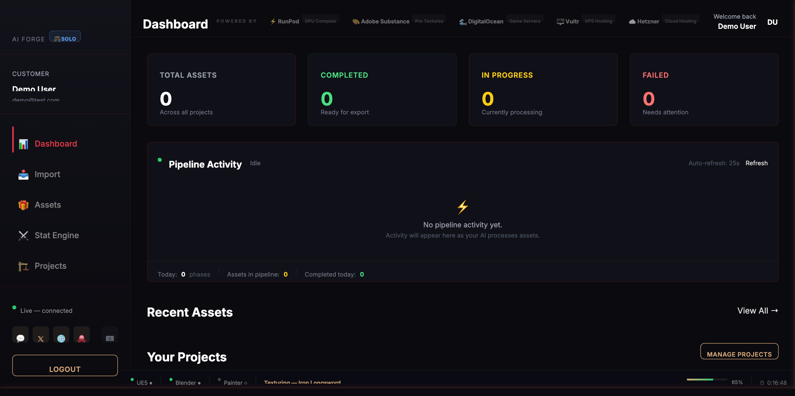
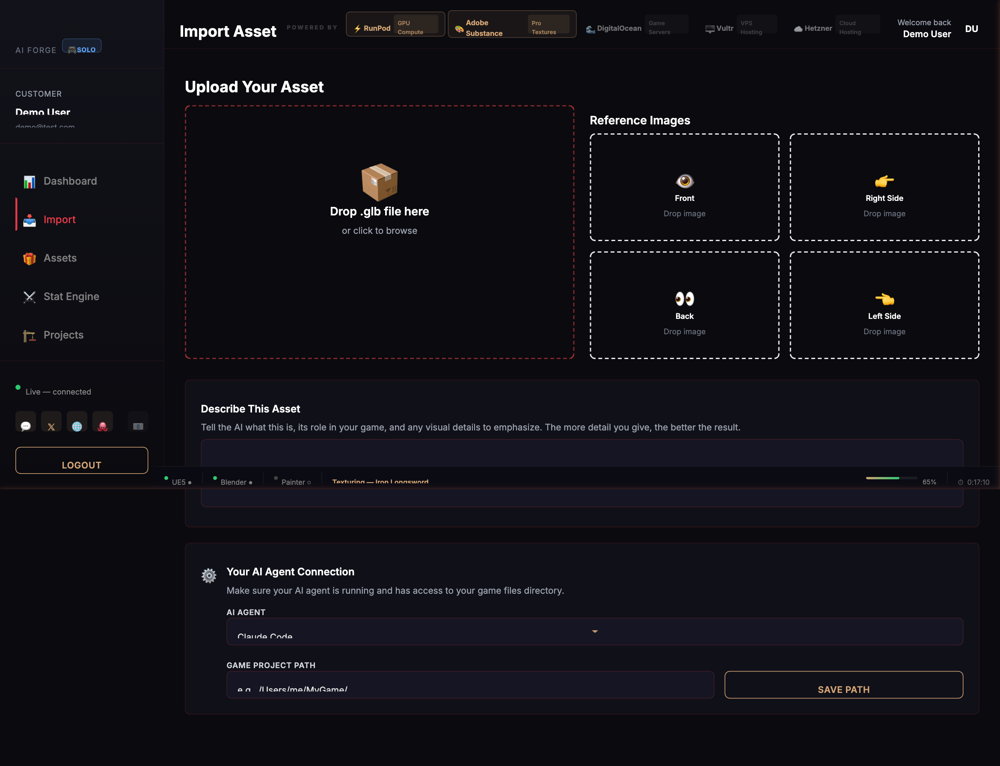
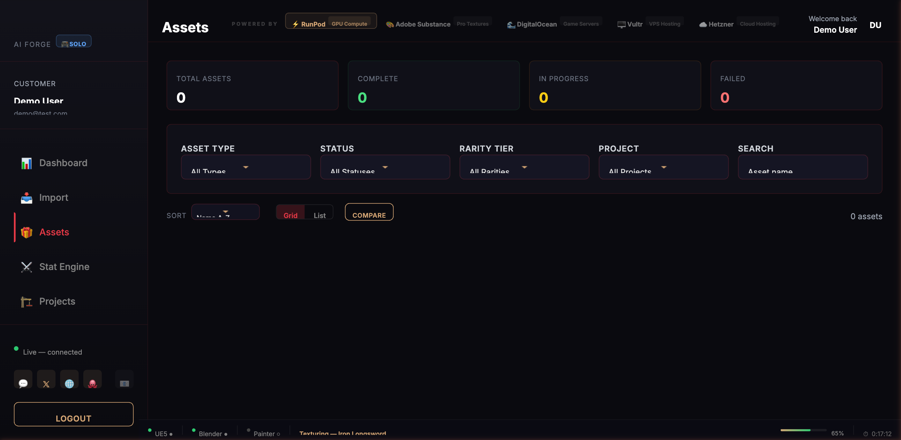
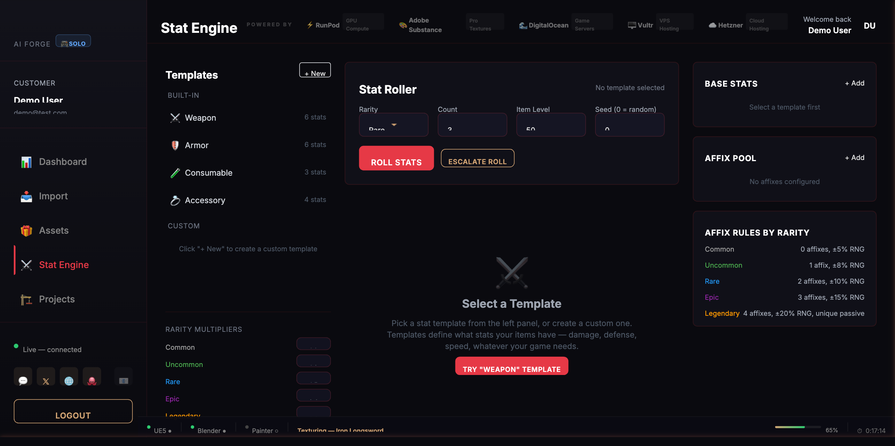
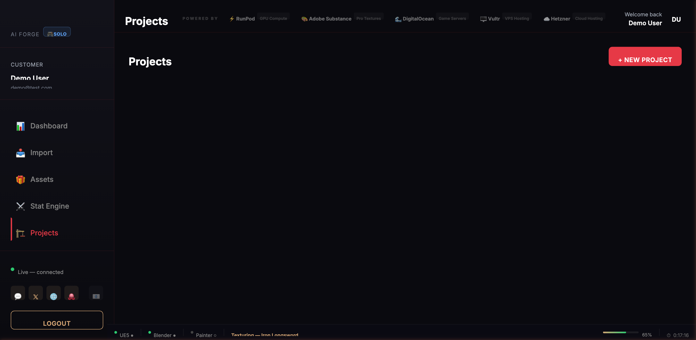
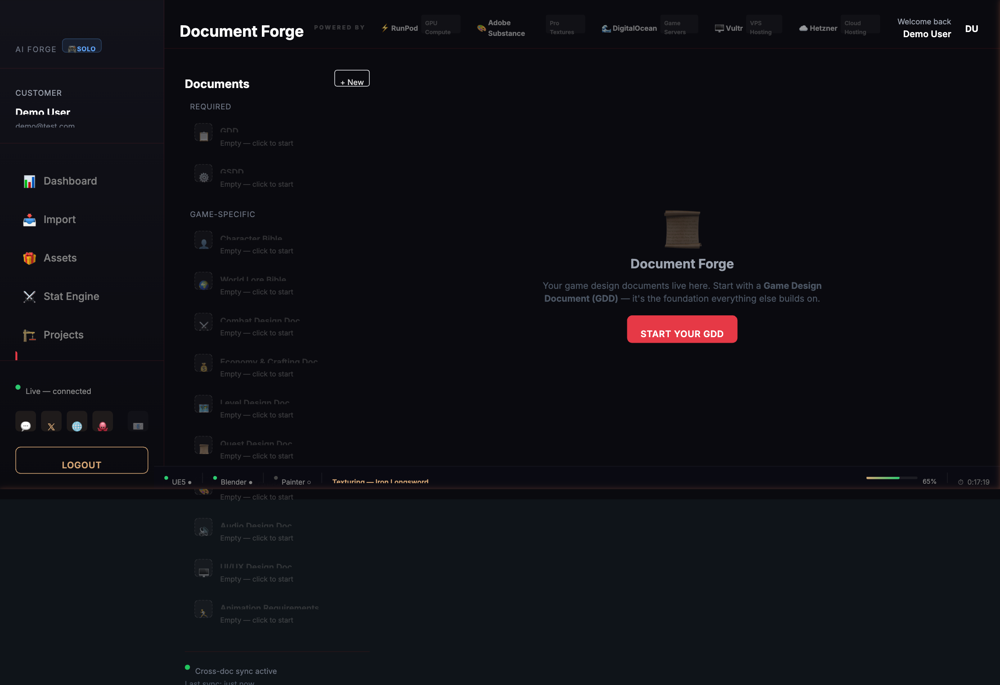
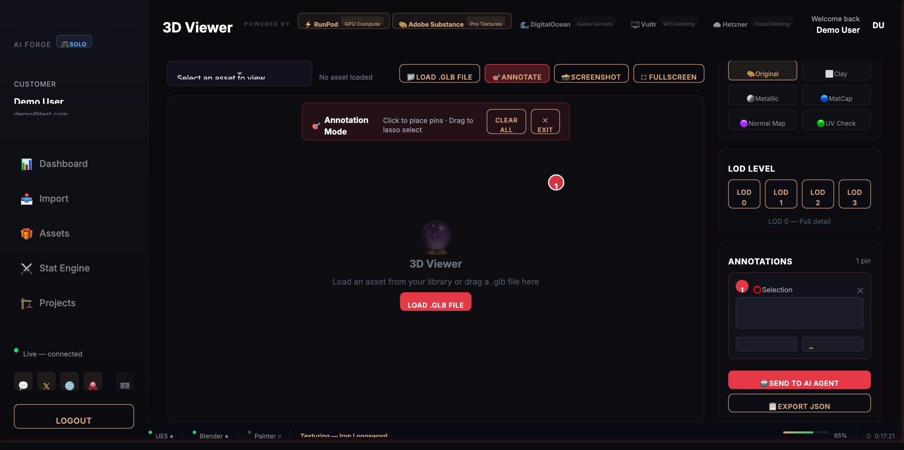
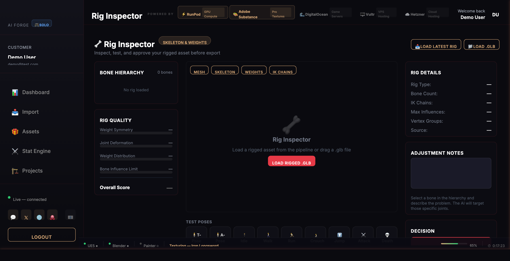
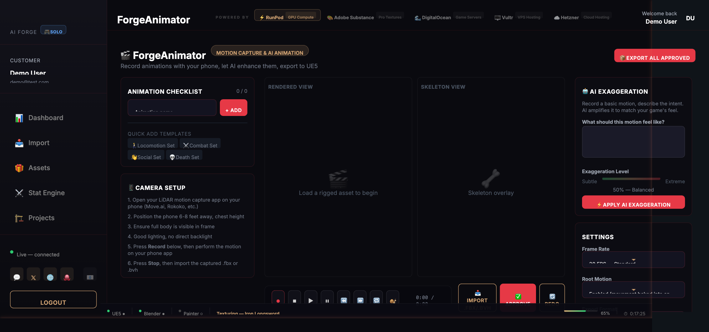
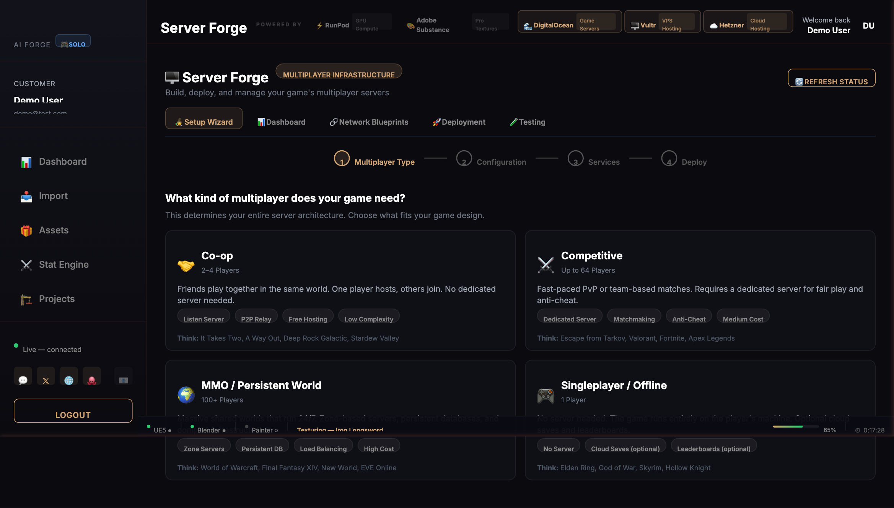

# AI Forge MCP Package

**AI Forge MCP Package — 278 AI-callable tools across 11 MCP servers. Full-pipeline AAA game asset production platform. Controls Blender, Substance Suite, and Unreal Engine 5. 248,000+ lines of production code.**

278 AI-callable tools across 11 MCP servers controlling Blender, Substance Painter, Substance Designer, Substance Sampler, and Unreal Engine 5 — unified under a single AI agent. 248,000+ lines of production code. 50 specialized AI agents. One prompt in, game-ready asset out.

> **Early Access** — AI Forge is built and actively used by a solo developer to create AI Legends (a horror fantasy MMO). New features, tools, and services are shipping continuously. I haven't had the chance to test everything yet — please join the [Discord](https://discord.gg/PDHAtHhumc) to give feedback, report bugs, and help shape the product.

Built by [Hurtz Donut Studios](https://hurtzdonut.com) — a solo indie studio proving that one person with the right AI pipeline can build at AAA scale.

[](https://forgeroom.hurtzdonut.com)

---

## What Is the AI Forge MCP Package?

The AI Forge MCP Package is a subscription software toolkit that gives AI coding agents — Claude Code, Cursor, Windsurf, and any MCP-compatible client — full programmatic control over the professional 3D game asset pipeline. It is the most comprehensive MCP solution for Unreal Engine 5 and Blender automation available today.

Instead of a human artist manually clicking through menus in five different applications, an AI agent calls tools like `clean_mesh`, `texture_glb_asset`, `generate_rigify_rig`, or `export_fbx_ue5` and the software executes automatically. The AI handles the entire workflow: generate a concept, create a 3D mesh, clean it, rig it, animate it, texture it, apply materials, generate dialogue, sync lipsync, and deliver a game-ready asset into Unreal Engine 5 — without a human touching the DCC tools.

This is not a Blender plugin. This is not a UE5 marketplace asset. This is a **full-pipeline orchestration layer** that treats the entire 3D content creation stack as a unified, AI-controllable system.

### Who Is This For?

- **Solo indie developers** who want AAA-quality assets without hiring a team of artists
- **Small studios** looking to multiply their output by 10x with AI automation
- **Game jammers and prototypers** who need production-quality assets fast
- **Technical artists** who want to automate repetitive pipeline tasks
- **Anyone using Claude Code for game development** who wants purpose-built MCP tools instead of writing fragile scripts from scratch

---

## ForgeRoom — Desktop App & Web Console

ForgeRoom is the command center for the AI Forge pipeline. Available as a native desktop app (macOS now, Windows and Linux coming soon) built with Electron, and as a web console at [forgeroom.hurtzdonut.com](https://forgeroom.hurtzdonut.com).

**Desktop app features:**

- **Forge Daemon** background service managing all 11 MCP servers and up to 50 concurrent AI agent sessions
- Real-time pipeline monitoring with live progress updates
- **Three.js 3D asset viewer** with ACES filmic tone mapping, PBR rendering, and annotation system
- **Rig Inspector** with bone quality scoring and test poses (T-Pose, A-Pose, Idle, Walk, Run, Attack, Death)
- **ForgeAnimator** with phone-based LiDAR mocap support (Move.ai, Rokoko) and AI exaggeration system *(LiDAR app coming soon)*
- **Document Forge** — full GDD/GSDD authoring suite with AI-assisted generation
- **Stat Engine** with rarity tiers, affix pools, and the Stat Roller
- **Server Forge** — multiplayer infrastructure wizard (Co-op, Competitive, MMO archetypes)
- First-launch wizard with auto-detection of Blender/UE5 and bridge plugin installation
- Auto-updater for seamless version upgrades

Pipeline documentation and agent prompts are delivered to the AI's context window at session start and never written to disk. Your IP stays protected, our IP stays protected.

---

## 50-Agent AI Studio

AI Forge includes 50 specialized AI agents that can work concurrently on your game:

**Lead Agents (Claude Opus):** Sovereign (orchestrator), Warden (security), Architect (project planning)

**Specialist Agents (Claude Sonnet):** Sculptor (mesh), Alchemist (materials), Bladedancer (combat animation), Worldsmith (environments), Dreamweaver (narrative), Luminary (lighting), Voiceshaper (dialogue/lipsync), and more

**Support Agents (Claude Haiku):** Quartermaster (inventory), Benchmark (performance), Lorekeeper (documentation), Scribe (specs), and more

Customers choose their team size based on workflow: 3 agents for focused work, 10 for steady production, or 50 for maximum throughput. No feature gating — team size is your choice, not a paywall.

---

## The 11 MCP Servers

| Server | Tools | What It Controls |
|--------|-------|-----------------|
| **ForgeBlender** | 97 | Blender — mesh cleanup, UV unwrapping, materials, rigging, LOD generation, cinematic texture enhancement, physics simulation, animation, FBX/GLB export |
| **GameForge** | 74 | Unreal Engine 5 — world building, material instances, VFX (Niagara), PCG, lighting, landscape sculpting, audio, cinematics (Sequencer) |
| **ForgeDesigner** | 25 | Substance Designer — procedural graph creation, node manipulation, noise chains, texture generation, material export, .sbsar publishing |
| **ForgePainter** | 17 | Substance Painter — project creation, layer management, smart materials, mesh map baking (AO, curvature, normal, thickness), texture export |
| **ForgeSampler** | 8 | Substance Sampler — photo-to-material scanning, environment capture, PBR material extraction |
| **ForgeMotion** | 7 | Animation — text-to-locomotion via HY-Motion (Tencent), text-to-combat via AnimationGPT, species-adapted motion physics |
| **ForgeRig** | 6 | Rigging — automatic skeleton prediction and skin weight generation via UniRig (VAST-AI, SIGGRAPH 2025) |
| **ForgeNPC** | 6 | NPC Systems — dialogue generation, personality profiles, interrogation trees, speech-to-text integration |
| **ForgeVoice** | 6 | Lipsync — facial animation generation, emotion classification, UE5 morph target export, batch processing |
| **ForgeRoom** | 28 | ForgeRoom UI bridge — state management, navigation, notifications, progress tracking, asset/document management, pipeline orchestration | Local stdio |
| **ForgeHunyuan** | 4 | 3D Generation — text-to-mesh and image-to-mesh via Hunyuan3D (Tencent), batch processing, LOD-aware output |

**Total: 278 tools | 11 servers | 248,000+ lines of production code**

---

## How It Works — The Full Pipeline

The AI Forge MCP Package automates the complete asset creation pipeline from concept to engine delivery. Here is every step:

```
Step 1:  Concept Art Generation ............. Grok (xAI) generates reference images
Step 2:  3D Mesh Generation ................ Hunyuan3D (Tencent) creates geometry from concept art
Step 3:  Mesh Cleanup ...................... ForgeBlender removes loose geometry, merges doubles, fixes normals
Step 4:  UV Unwrapping ..................... ForgeBlender verifies and optimizes UV layouts
Step 5:  Texture Enhancement ............... ForgePainter bakes mesh maps + ForgeDesigner builds procedural materials
         (fallback) ....................... ForgeBlender cinematic enhancement if Substance unavailable
Step 6:  Rigging ........................... ForgeRig auto-generates skeleton via UniRig AI
Step 7:  Weight Painting ................... ForgeBlender optimizes weights — edge loops, pruning, symmetry, deformation testing
Step 8:  Animation ......................... ForgeMotion generates locomotion (HY-Motion) + combat (AnimationGPT)
Step 9:  NPC Dialogue & Lipsync ............ ForgeNPC generates dialogue, ForgeVoice creates lipsync animations
Step 10: LOD Generation .................... ForgeBlender creates multi-level-of-detail chain for performance
Step 11: UE5 Delivery ...................... GameForge imports into Unreal Engine 5 with materials, LODs, and collision
```

**Input:** A .glb file + a reference image + a plain-English description of what you want.

**Output:** A fully rigged, textured, animated, lip-synced, UE5-ready asset with LODs, collision, and proper material setup.

---

## ForgeRoom — Mission Control

ForgeRoom is the command center where you manage your entire AI Forge pipeline. Every asset, every pipeline run, every game design document — all in one place. Available as a native desktop app (macOS now, Windows and Linux coming soon) and as a web console at [forgeroom.hurtzdonut.com](https://forgeroom.hurtzdonut.com).

### Dashboard

Real-time pipeline overview with asset counts, processing status, activity feed with auto-refresh, and quick access to recent assets and projects.


### Import Asset

Drag-and-drop .glb upload with multi-angle reference image support (Front, Right, Back, Left views). Rich text description for telling the AI exactly what the asset should look like. AI Agent Connection panel for linking your MCP client to your game project.



### Asset Library

Full asset management with filtering by type, status, rarity tier, and project. Grid and list views. Side-by-side asset comparison. Complete audit trail of every pipeline operation.



### Stat Engine

Game item stat generation with built-in templates (Weapon, Armor, Consumable, Accessory). Stat Roller with configurable rarity, count, item level, and seed. Rarity multiplier system (Common 1.0x through Legendary 3.0x). Affix pool with rules by rarity tier. Escalate Roll for iterative refinement.



### Projects

Multi-project management for organizing assets across different games. Each project tracks its own asset registry, pipeline history, and configuration.



### Document Forge

Complete game design document authoring. Required docs (GDD, GSDD) plus game-specific docs: Character Bible, World Lore Bible, Combat Design, Economy & Crafting, Level Design, Quest Design, Art Style Guide, Audio Design, UI/UX Design, and Animation Requirements. AI-assisted generation starting from a GDD foundation.



### 3D Viewer

In-browser 3D model viewer with multiple material modes (Original, Clay, Metallic, MatCap, Normal Map, UV Check). LOD level switching (LOD 0–3). Annotation mode with pin placement and lasso selection for marking areas that need AI attention. Full lighting controls. "Send to AI Agent" passes annotations directly to the pipeline.



### Rig Inspector

Post-rigging QA tool. Bone hierarchy browser. Mesh, Skeleton, Weights, and IK Chains visualization. Rig quality scoring (Weight Symmetry, Joint Deformation, Weight Distribution, Bone Influence Limit). Adjustment Notes for describing issues. Test poses: T-Pose, A-Pose, Idle, Walk, Run, Crouch, Jump, Attack, Death. Approve/Reject/Redo workflow.



### ForgeAnimator

Motion capture and AI animation system. Phone-based LiDAR capture (Move.ai, Rokoko) with camera setup guide *(LiDAR companion app coming soon)*. Animation checklist with quick-add templates (Locomotion, Combat, Social, Death sets). Dual viewport with Rendered + Skeleton overlay. AI Exaggeration — record a basic motion, describe what it should feel like, and the AI amplifies the capture to match. Direct UE5 export.



### Server Forge

Multiplayer server infrastructure wizard. 4-step guided setup: Multiplayer Type, Configuration, Services, Deploy. Four archetypes: Co-op (2–4 players, P2P, free), Competitive (up to 64, dedicated server, matchmaking), MMO (100+, zone-based, persistent DB), Singleplayer (optional cloud saves). Generates UE5 networking code, Docker deployment files, and supporting services.



---

## The 6 AI Backends (+ NVIDIA ACE Coming Soon)

This pipeline integrates six AI systems, each handling what it does best. We believe in full transparency about what powers the work. NVIDIA ACE integration for advanced NPC intelligence is in development.

### Grok by xAI — Concept Art Generation
All reference images and concept art can be generated using xAI's Grok. High-quality visual direction that feeds directly into the 3D pipeline. Used commercially under X/xAI Terms of Service with attribution.

### Hunyuan3D by Tencent — Text/Image to 3D Mesh
Takes concept art or text prompts and produces raw 3D geometry. Open source under MIT License. Handles the leap from 2D reference to 3D model automatically.

### UniRig by VAST-AI Research — AI Auto-Rigging (SIGGRAPH 2025)
GPT-based auto-rigger that predicts skeleton hierarchies and skin weights from raw meshes in seconds. No manual bone placement needed. Published at SIGGRAPH 2025.

### HY-Motion by Tencent — AI Locomotion Animation
1-billion parameter DiT model trained on 3,000+ hours of motion capture data across 200+ movement categories. Powers all locomotion: walking, running, jumping, climbing, swimming, flying. Open source.

### AnimationGPT — AI Combat Animation
Combat-specialized motion model with 8,700 combat animations and 26,100 text annotations tagged by weapon type, attack type, speed, and power. Generates contextual combat sequences from plain-English descriptions.

### Claude by Anthropic — Pipeline Orchestration
The AI coding agent that ties everything together. Claude reads the pipeline configuration, calls tools across all 11 MCP servers, makes creative decisions based on the reference image, and delivers finished assets. Claude is the creative director — the MCP servers are its tools. With the 50-agent studio, Claude powers an entire team of specialized AI agents working concurrently on your game.

---

## Species-Aware Animation Profiles

The AI Forge MCP Package includes 16 built-in species animation profiles that automatically adjust movement physics based on creature characteristics. The AI does not need manual configuration — the system reads the species profile and adapts all animation parameters automatically.

**How it works:** Each species profile defines height, weight, stride length, movement speed, center of gravity, limb proportions, and physics properties. When the animation system generates movement for a 15-foot ogre, it automatically produces heavy, lumbering footfalls with ground shake. When generating movement for a 5-foot elf, it produces fast, agile, light-footed motion. The same text prompt — "run forward" — produces physically different animations for every species.

**10 Playable Species Profiles:** Human, Elf, Dwarf, Orc, Ogre, Troll, Goblin, Undead, Demon, Dragon-Kin

**6 Creature Profiles:** Wolves/Canines, Bears/Large Quadrupeds, Serpents, Avian, Arachnids, Elementals

Each profile is customizable. Customers can modify existing profiles or create new species with their own physical characteristics, and the animation system adapts to match.

---

## 5 Asset Pipelines

The package supports five distinct asset production pipelines, each with specialized tool chains:

### Characters (Playable)
32-bone extended skeleton with finger bones, bilateral symmetry enforcement, anatomical proportion validation, facial rig for lipsync, full locomotion + combat animation suite.

### Creatures & NPCs
24-bone skeleton, species-specific animation profiles, weight class physics, NPC dialogue generation, personality profiles, lipsync support for speaking NPCs.

### Weapons
Geometric correction (blade straightening, symmetry enforcement), rarity-tiered material complexity (common through legendary), grip alignment for character hand bones, physics properties for combat animation.

### Armor
Slot-based system (head, chest, legs, feet, hands, shield), material-type classification (metal, leather, cloth, bone), high-poly to low-poly bake workflow, proper weight painting for character deformation.

### Environments
Enterable buildings with wall thickness, door and window cutting, stair generation, interior geometry, landscape integration via UE5 PCG, proper lightmap UVs for static lighting.

---

## Key Stats

| Metric | Value |
|--------|-------|
| MCP Servers | 11 custom-built (13 with Maya + Houdini roadmap) |
| Total AI-Callable Tools | 278 |
| Lines of Production Code | 248,000+ |
| Specialized AI Agents | 50 |
| Supported Applications | 5 (Blender, Substance Designer, Substance Painter, Substance Sampler, Unreal Engine 5) |
| AI Backend Integrations | 6 (Grok, Hunyuan3D, UniRig, HY-Motion, AnimationGPT, Claude) |
| Species Animation Profiles | 16 (10 playable + 6 creature) |
| Asset Type Pipelines | 5 (characters, creatures, weapons, armor, environments) |
| ForgeRoom Dashboard Modules | 10 (Dashboard, Import, Assets, Stat Engine, Projects, Document Forge, 3D Viewer, Rig Inspector, ForgeAnimator, Server Forge) |
| Desktop Platforms | 3 (macOS, Windows, Linux) |
| REST API Endpoints | 40+ |
| Security Layers | 8 |
| Art Style Profiles | 4 (horror_fantasy, photorealistic, stylized, cel_shaded) |
| Bridge Plugins | 4 (Blender, Painter, Designer, Sampler) |

---

## Technical Requirements

### Required (Free)

- **Blender 4.0+** — [Download](https://www.blender.org/download/) (free, open source)
- **Unreal Engine 5.3+** — [Download](https://www.unrealengine.com/download) (free until $1M gross revenue)
- **Python 3.10+** — [Download](https://www.python.org/downloads/)
- **Node.js 18+** — [Download](https://nodejs.org/)
- **An MCP-compatible AI agent** — Claude Code, Cursor, Windsurf, or any client supporting the Model Context Protocol

### Optional (Improves Quality)

- **Adobe Substance Painter** — Professional texture painting and mesh map baking
- **Adobe Substance Designer** — Procedural material graph authoring
- **Adobe Substance Sampler** — Photo-to-material scanning

> **The pipeline works without Substance apps.** The Blender-native cinematic enhancement path produces excellent results on its own. Substance apps elevate the quality further when available.

### Optional AI Backends (Free, Open Source)

- **UniRig** — AI auto-rigging, requires NVIDIA GPU with 8GB+ VRAM ([GitHub](https://github.com/VAST-AI-Research/UniRig))
- **HY-Motion** — AI locomotion animation, requires NVIDIA GPU with 24GB+ VRAM
- **AnimationGPT** — AI combat animation, requires NVIDIA GPU

### Hardware Requirements

> **Important: The AI Forge MCP Package itself uses zero GPU.** It is a tool orchestration layer — lightweight Python processes communicating over stdio. The GPU requirements listed below come entirely from the third-party software the pipeline controls (Blender, Unreal Engine 5, UniRig, HY-Motion, Hunyuan3D). If you already run Blender and UE5 on your machine, you already meet the requirements.

**Minimum (Blender + UE5 pipeline, no local AI generation):**

- **GPU:** Any GPU that runs Blender 4.x and UE5 (GTX 1070 / RX 5700 or better)
- **VRAM:** 4GB+
- **RAM:** 16GB
- **Storage:** SSD with 30GB+ free

**Recommended (Full pipeline with AI backends):**

- **GPU:** NVIDIA RTX 3080 or better (CUDA required for UniRig and HY-Motion)
- **VRAM:** 8GB+ (24GB+ for HY-Motion locomotion generation)
- **RAM:** 32GB minimum, 64GB+ recommended
- **Storage:** SSD with 50GB+ free space

The MCP servers themselves run on CPU and use minimal resources (~50MB RAM per server). GPU load comes from Blender rendering, UE5 viewport, and optional AI backends — the same GPU load you'd have using those applications without AI Forge.

---

## Pricing

| Tier | Seats | Founder Price | MSRP |
|------|-------|---------------|------|
| **Solo** | 1 dev | **$35/mo** | $79/mo |
| **Duo** | 2 devs | **$65/mo** | $139/mo |
| **Studio** | 5 devs | **$149/mo** | $249/mo |
| **Enterprise** | Unlimited | Custom | Custom |

All tiers get the full pipeline — all 278 tools, all 11 servers, all 50 agents. No feature gating. Pricing is seat-based only. Student discount and veteran/military discount available. Contact [hurtzdonut.com](https://hurtzdonut.com) for details.

### Early Access — Founder Pricing

AI Forge MCP Package is currently in **early access**. The core pipeline is production-ready and actively used to build AI Legends (our proof-of-work MMO). New features, servers, and tools are being added continuously.

**Founder pricing is locked forever at your signup rate.** When we move to general availability, prices go to MSRP. Sign up now to lock in the founder rate permanently.

Early access subscribers also get:

- **Direct input** on feature priorities and new tool development
- **First access** to new MCP servers and AI backend integrations as they ship

---

## The Proof of Work — AI Legends

AI Legends is a horror fantasy MMO being built entirely by the AI Forge MCP Package. Every asset in the game — characters, creatures, weapons, armor, environments — is produced by this pipeline. It serves as the living proof that the system works at production scale.

AI Legends demonstrates the full capability chain: Grok generates concept art, Hunyuan3D creates 3D meshes, ForgeBlender cleans and optimizes geometry, UniRig auto-rigs skeletons, HY-Motion and AnimationGPT generate movement and combat animations, the Substance suite handles materials and textures, ForgeNPC creates dialogue, ForgeVoice generates lipsync, and GameForge delivers everything into Unreal Engine 5.

One developer. One AI pipeline. One game.

---

## Competitive Landscape

There is no comparable product on the market. Individual components exist — Blender MCP plugins, UE5 automation scripts, standalone AI rigging tools — but nothing chains the **entire AAA pipeline** under unified AI control from concept art through engine delivery. The closest alternatives require human operators at every handoff point between applications.

The AI Forge MCP Package eliminates those handoffs. One AI agent, one conversation, one prompt — and a game-ready asset comes out the other end.

---

## Security & IP Protection

AI Forge uses an 8-layer security chain to protect both our pipeline IP and your game assets:

- **Source code compiled via Nuitka** — Python compiled to C, then to native binary. Customers get full functionality, never source code.
- **Pipeline docs served to AI context only** — Documentation and agent prompts are fetched from the cloud at session start and held in the AI's memory. Never written to disk. Never cached locally.
- **JWT auth with rate limiting** on the context delivery API — prevents bulk scraping or unauthorized access.
- **CLAUDE.md directives** — Technical layer that prevents AI agents from extracting or reproducing pipeline internals.
- **TOS legal prohibition** — Contractual enforcement against reverse engineering, extraction, and replication.
- **Hardware fingerprint binding** — Each license is tied to the customer's machine.
- **24-hour license heartbeat** — Compiled binaries validate the license on startup and every 24 hours during operation.
- **Forensic watermark** — Exported assets contain an invisible watermark tied to the customer's license key, enabling trace-back if assets are leaked.

---

## Roadmap

**Coming Soon:**

- **ForgeMaya** — Maya MCP server for AAA studio pipelines
- **ForgeHoudini** — Houdini MCP server for procedural VFX workflows
- **NVIDIA ACE integration** — Advanced NPC intelligence and real-time conversation
- **ForgeAnimator LiDAR app** — Phone-based motion capture companion app

With Maya and Houdini, the platform reaches **13 MCP servers** covering every major DCC application in professional game development. More features, tools, and services are in active development.

---

## Attribution & Licenses

This product integrates multiple open-source and commercial AI platforms. Full attribution:

- **Grok image generation by xAI** — Concept art generated using Grok. Used commercially under X/xAI Terms of Service with attribution.
- **Hunyuan3D by Tencent** — Open source (MIT License)
- **UniRig by VAST-AI Research** — Open source (SIGGRAPH 2025)
- **HY-Motion by Tencent** — Open source
- **AnimationGPT** — Open source (based on MotionGPT + CombatMotion dataset)
- **Blender** — GNU GPL
- **Unreal Engine 5** — Epic Games EULA (free until $1M gross revenue)
- **Substance Suite** — Adobe commercial license (customer provides their own)

---

## Get Access

Early founder pricing available — locked forever at signup rate.

- **ForgeRoom Dashboard:** [forgeroom.hurtzdonut.com](https://forgeroom.hurtzdonut.com)
- **Back the Build:** [hurtzdonut.com/back-the-build](https://hurtzdonut.com/back-the-build)
- **Discord:** [discord.gg/PDHAtHhumc](https://discord.gg/PDHAtHhumc)

---

*AI Forge MCP Package — Hurtz Donut Studios*
*Built by Jeremy Fawcett*
*Proof of work: AI Legends — a horror fantasy MMO built entirely by AI agents using this pipeline*
